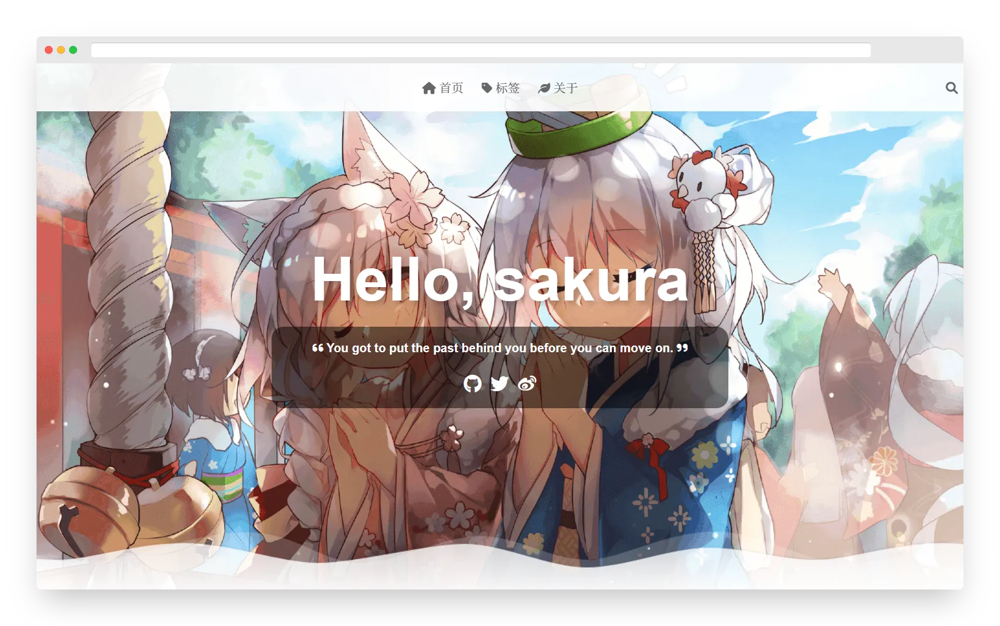

# vitepress-theme-sakura

[](https://www.npmjs.com/package/vitepress-theme-sakura)
[](https://github.com/flaribbit/vitepress-theme-sakura/actions)

可爱又轻量的二次元博客主题！大概是隔壁wp主题的移植吧

[在线预览](https://flaribbit.github.io/vitepress-theme-sakura/)



## 快速开始

安装依赖，推荐使用 pnpm 包管理器，如果没有的话根据自己的情况把命令中的 `pnpm` 换成 `npm` 或者 `yarn`。

```
pnpm add vitepress vitepress-theme-sakura sass
```

创建配置文件

`.vitepress/config.ts`
```ts
import { type ThemeConfig } from 'vitepress-theme-sakura/.vitepress/config'
import { defineConfigWithTheme } from 'vitepress'
import fixKatex from 'vitepress-theme-sakura/.vitepress/fix-katex'
export default defineConfigWithTheme<ThemeConfig>({
  lang: 'zh-CN',
  title: 'xxx的小站',
  head: [
    // 字体支持
    ['link', { rel: 'stylesheet', href: 'https://cdn.jsdelivr.net/npm/@fortawesome/fontawesome-free@6.0.0/css/regular.min.css' }],
    ['link', { rel: 'stylesheet', href: 'https://cdn.jsdelivr.net/npm/@fortawesome/fontawesome-free@6.0.0/css/all.min.css' }],
    ['link', { rel: 'stylesheet', href: 'https://fonts.googleapis.com/css?family=Noto+Serif+SC' }],
    // waline
    ['script', { src: 'https://cdn.jsdelivr.net/npm/@waline/client@1.5.4/dist/Waline.min.js' }],
    // katex
    ['script', { src: 'https://cdn.jsdelivr.net/npm/katex@0.15.2/dist/katex.min.js' }],
    ['script', { src: 'https://cdn.jsdelivr.net/npm/katex@0.15.2/dist/contrib/auto-render.min.js' }],
    ['link', { rel: 'stylesheet', href: 'https://cdn.jsdelivr.net/npm/katex@0.15.2/dist/katex.min.css' }],
  ],
  markdown: {
    theme: 'github-light',
    lineNumbers: true,
    config: md => { md.use(fixKatex) },
  },
  themeConfig: {
    // ...
  }
})
```

其中 `themeConfig` 里面的内容就是要手动填写的主题配置。

`.vitepress/theme/index.ts`
```ts
import { type EnhanceAppContext } from 'vitepress'
// @ts-ignore
import Layout from 'vitepress-theme-sakura'

export default {
  Layout,
  NotFound: () => 'custom 404', // <- this is a Vue 3 functional component
  enhanceApp({ app, router, siteData }: EnhanceAppContext) {
    // app is the Vue 3 app instance from `createApp()`. router is VitePress'
    // custom router. `siteData`` is a `ref`` of current site-level metadata.
  }
}
```

然后创建 `posts` 目录，编写 markdown 文件保存到 `posts` 目录中。

执行 `vitepress dev` 命令，以开发模式预览效果；

执行 `vitepress build` 命令，构建用于发布的网页文件，输出到 `.vitepress/dist` 目录中。

## 主题配置

```ts
export interface ThemeConfig {
  name?: string, // 名字，用于显示文章作者等
  cover?: string, // 首页封面图
  hello?: string, // 首页问候语
  motto?: string, // 首页签名
  social?: { icon: string, url: string }[], // 联系方式
  waline?: string, // waline 评论系统服务端地址
}
```

代码块主题配置，参见 [shiki 主题](https://github.com/shikijs/shiki/blob/main/docs/themes.md#all-themes)
```ts
export type Theme =
  | 'css-variables'
  | 'dark-plus'
  | 'dracula-soft'
  | 'dracula'
  | 'github-dark-dimmed'
  | 'github-dark'
  | 'github-light'
  | 'hc_light'
  | 'light-plus'
  | 'material-darker'
  | 'material-default'
  | 'material-lighter'
  | 'material-ocean'
  | 'material-palenight'
  | 'min-dark'
  | 'min-light'
  | 'monokai'
  | 'nord'
  | 'one-dark-pro'
  | 'poimandres'
  | 'rose-pine-dawn'
  | 'rose-pine-moon'
  | 'rose-pine'
  | 'slack-dark'
  | 'slack-ochin'
  | 'solarized-dark'
  | 'solarized-light'
  | 'vitesse-dark'
  | 'vitesse-light'
```

## 文章配置
```md
---
title: 标题
date: 日期
cover: 封面图
tags: [标签1, 标签2]
---

这里的文字会作为预览显示在文章列表中

---

这里的文字点进文章才能看到
```

## 功能
- [x] 首页横幅
- [x] 文章列表
- [x] 文章样式
- [x] waline 评论
- [x] 文章导航
- [x] 代码高亮
- [x] 手机端适配
- [x] 目录
- [x] 目录锚点双向同步
- [x] 标签页面
- [x] latex 公式
- [x] RSS
- [ ] 页脚
- [ ] 搜索
- [ ] PWA

## 其他说明
如你所见，这个博客主题完成度不是很高。

我写这个主题的初衷有两个，一是为了学习前端，二是看到隔壁 wordpress 主题的性能太烂了，所以就想着移植一下。

如果你想安安静静写博客，需要体验友好、性能绝佳、扩展性出色的博客系统，推荐看一下 [Valaxy](https://valaxy.site/).

如果你希望学习自制博客所需要的前端技术，但目前是小白，那或许可以参考本项目代码。本项目代码质量不高，但毕竟也是小白写的，所以应该比较容易看懂。如果不是小白，则可以参考 [云猫猫的 Valaxy 仓库](https://github.com/YunYouJun/valaxy)。

## 感谢
- [wordpress-theme-sakura](https://github.com/mashirozx/sakura)
- [hexo-theme-yun](https://github.com/YunYouJun/hexo-theme-yun)
- [vuejs/blog](https://github.com/vuejs/blog)
- [wordpress-theme-Sakurairo](https://github.com/mirai-mamori/Sakurairo)
- [xiaowai-api](https://api.ixiaowai.cn/)

## 不感谢
- 某个关闭图床的网站
